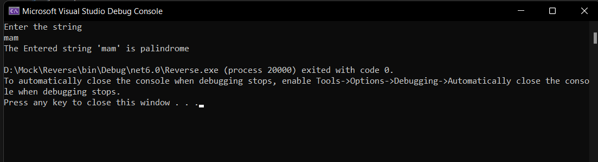
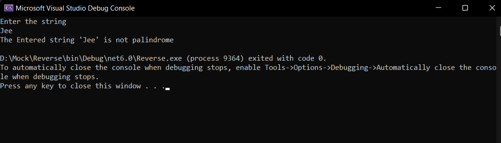

# Palindrome


## Aim:
To write a C# program to find whether the given string is a Palindrome or not.
# Algorithm:
## Step 1:
To start the C# program in visual Studio 2022.

## Step 2:
Create a class and declare two variable with string datatype.

## Step 3:
Loop over the entire string and reverse it.

## Step 4:
Use if condition to check whether the string and the reversed string is equal or not.

## Step 5:
print palindrome if it's equal else print not a palindrome.

## Step 6:
Save the program and run the program in visual studio 2022.

## Program:
```
using System;
namespace palindrome
{
    class Program
    {
        static void Main(string[] args)
        {
            string s, revs = "";
            Console.WriteLine("Enter the string");
            s = Console.ReadLine();
            s = s.ToLower();
            for (int i = s.Length - 1; i >= 0; i--)
            {
                revs += s[i];
            }
            if (revs == s)
            {
                Console.WriteLine("The entered string is Palindrome");
            }
            else
            {
                Console.WriteLine("The entered string is not Palindrome");
            }
        }
    }
}

```
## Output 1:

## Output 2:

## Result:
Thus the C# program to display whether the given string is Palindrome or not is executed successfully.
